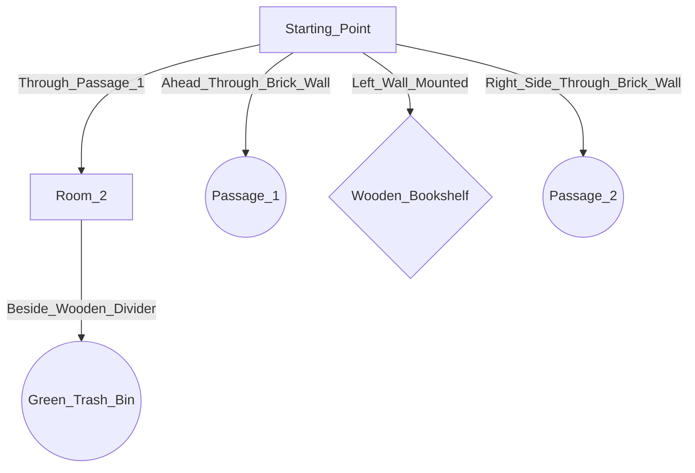

# CARS Cognitive Topological Map

*Last updated: 2026-10-01 16:41:34*

```mermaid
graph TD
    Starting_Point[Starting_Point] -->|Through_Passage_1| Room_2[Room_2]
    Starting_Point -->|Ahead_Through_Brick_Wall| Passage_1((Passage_1))
    Starting_Point -->|Left_Wall_Mounted| Wooden_Bookshelf{Wooden_Bookshelf}
    Starting_Point -->|Right_Side_Through_Brick_Wall| Passage_2((Passage_2))
    Room_2 -->|Beside_Wooden_Divider| Green_Trash_Bin((Green_Trash_Bin))

```
