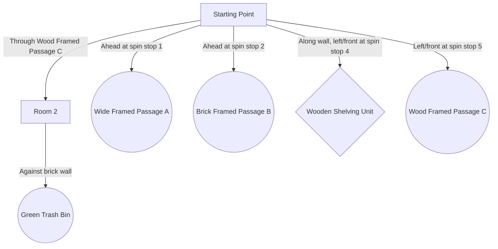

# CARS Cognitive Topological Map

*Last updated: 2026-10-01 10:50:49*

```mermaid
graph TD
    Starting_Point[Starting Point] -->|Through Wood Framed Passage C| Room_2[Room 2]
    Starting_Point -->|Ahead at spin stop 1| Wide_Framed_Passage_A((Wide Framed Passage A))
    Starting_Point -->|Ahead at spin stop 2| Brick_Framed_Passage_B((Brick Framed Passage B))
    Starting_Point -->|Along wall, left/front at spin stop 4| Wooden_Shelving_Unit{Wooden Shelving Unit}
    Starting_Point -->|Left/front at spin stop 5| Wood_Framed_Passage_C((Wood Framed Passage C))
    Room_2 -->|Against brick wall| green_trash_bin((Green Trash Bin))

```
